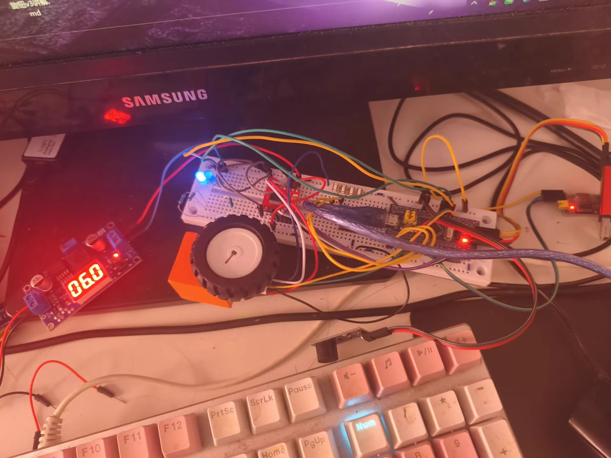
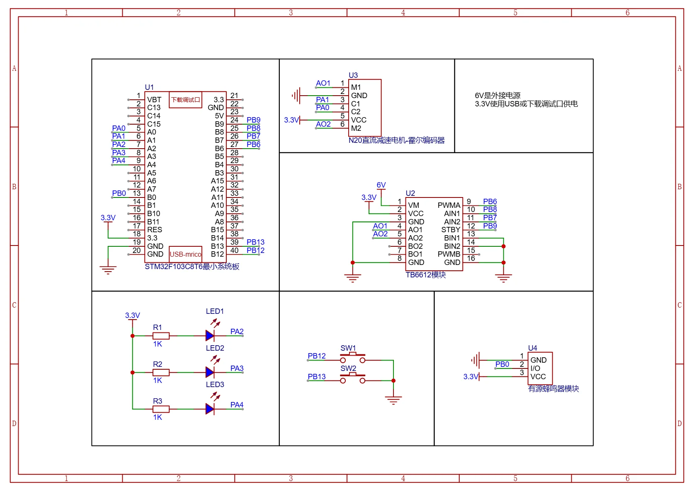
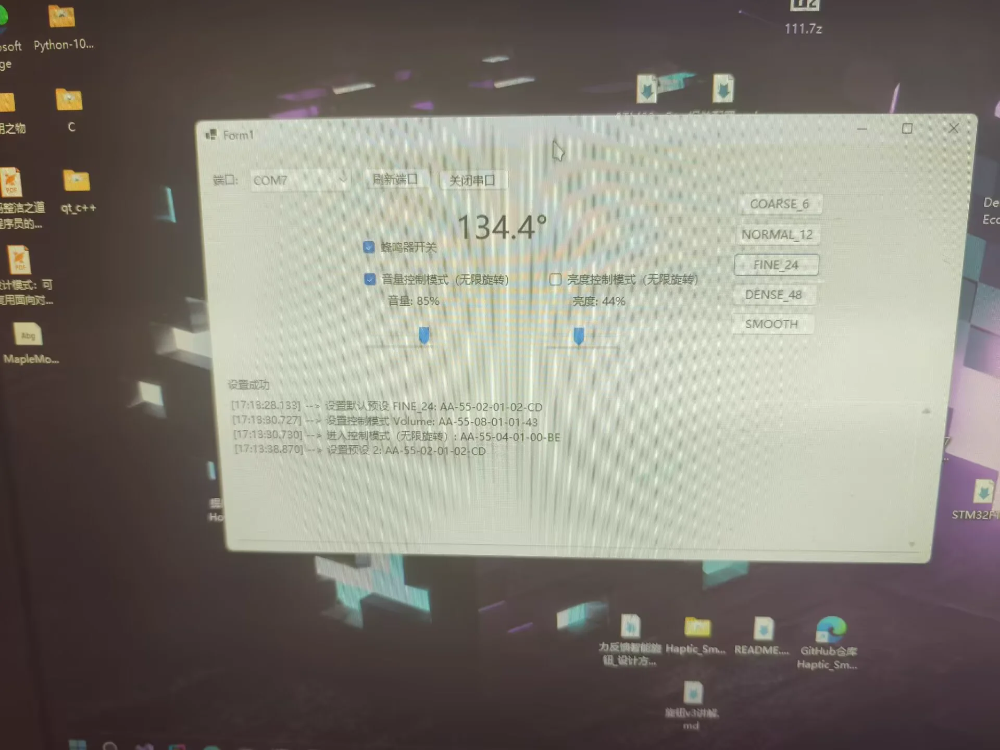

# 力反馈智能旋钮（Haptic Smart Knob）

灵感来源于 [SmartKnob](https://github.com/scottbez1/smartknob)
本项目使用低成本的 **N20 直流减速电机编码器版**，模拟实现力反馈旋钮：旋转时产生真实的"一格一格"卡位手感，松手自动归中，支持角度限位与多种预设手感。

> 项目以 **STM32 下位机为核心**，固件独立完成全部力反馈闭环控制；C# 上位机作为配套工具，负责与电脑联动（音量/亮度控制）与调试。

## Haptic_Smart_Knob（STM32 下位机）主项目

基于 STM32F103C8T6 + N20 减速电机 + TB6612 驱动，独立实现完整的力反馈控制：

- **力反馈闭环**：1kHz 控制循环 + 状态机，实现卡位爬坡棘轮手感、松手归中、限位弹簧-阻尼反馈
- **USB-CDC 双向协议**：双字节同步头 + CRC8 校验 + 逐字节解析状态机
- **控制模式**：空闲 / 音量 / 亮度三态，按键切换 + LED 指示
- 详细架构见 `Haptic_Smart_Knob/README.md`

### 实物图

  

### 电路图

  

## Haptic_Knob_Host（C# 上位机）配套

基于 C# WinForms (.NET 8) 的 PC 端配套程序：

- 通过 USB-CDC 与下位机双向通信，50ms 轮询状态
- 控制电脑音量（NAudio）与屏幕亮度（WMI）
- 详见 `Haptic_Knob_Host/README.md`

### 上位机UI图

  

## 最终完成项目的感想

卡位手感来说每圈 12 与 24 个卡位点是最舒服的，这个编码器一圈只有2800编码值
并且因为是减速比1：100的直流电机，很难或者说做不到无刷云台电机那样精确的控制
我为什么选择使用N20呢，因为手边正好有，而且这个电机确实便宜，20块一个

但最终实现的效果还不错，得益于C#提供许多了Windows的API接口可以很方便的控制电脑

后续可能会控制更多媒体功能，比如音乐播放以及视频进度条调节
